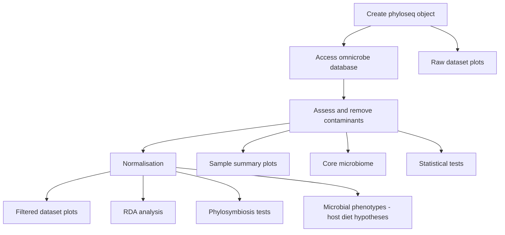
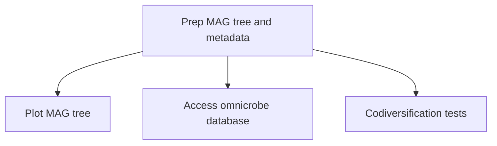

Analysis workflow for taxonomic community-level analysis:

```mermaid
flowchart TD;
    A[Create phyloseq object]-->B[Access omnicrobe database];
    A-->C[Raw dataset plots];
    B-->D[Assess and remove contaminants];
    D-->E[Normalisation];
    D-->F[Sample summary plots];
    D-->G[Core microbiome];
    E-->H[Filtered dataset plots];
    E-->I[RDA analysis];
    E-->J[Phylosymbiosis tests];
    E-->K[Microbial phenotypes - host diet hypotheses];
    D-->L[Statistical tests];
```
Analysis workflow for functional community-level analysis:

```mermaid
flowchart TD;
    A[Prepare data];
```

Analysis workflow for metagenomes-assembled genomes analysis:

```mermaid
flowchart TD;
    A[Prep MAG tree and metadata]-->B[Plot MAG tree]
    A-->C[Access omnicrobe database]
    A-->D[Codiversification tests]
```
